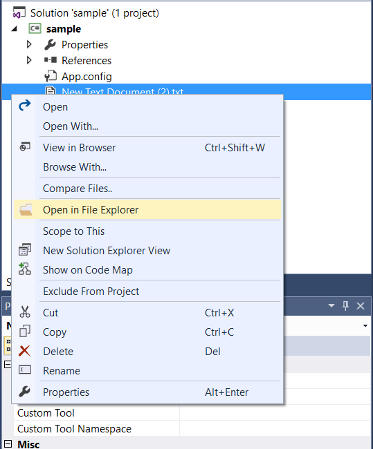
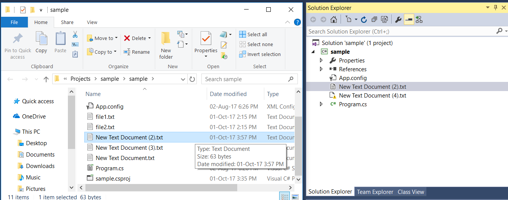

# File_Explorer

<!-- Update the VS Gallery link after you upload the VSIX-->
Download this extension from the [VS Gallery](https://visualstudiogallery.msdn.microsoft.com/[GuidFromGallery])

or get the [CI build](http://vsixgallery.com/extension/0f53b279-3ac6-4152-9950-b2dd9dd3f80a/).

---------------------------------------

Locate and open files from Solution Explorer in File Explorer

See the [change log](CHANGELOG.md) for changes and road map.

## Features

- Open any files from Solution Explorer in File Explorer in a single click

### Open Files in Files Explorer

Select any no. of files and right click and select "Open in File Explorer"

Then click it to open the file in File Explorer

## Contribute
Check out the [contribution guidelines](CONTRIBUTING.md)
if you want to contribute to this project.

For cloning and building this project yourself, make sure
to install the
[Extensibility Tools 2015](https://visualstudiogallery.msdn.microsoft.com/ab39a092-1343-46e2-b0f1-6a3f91155aa6)
extension for Visual Studio which enables some features
used by this project.

## License
[Apache 2.0](LICENSE)